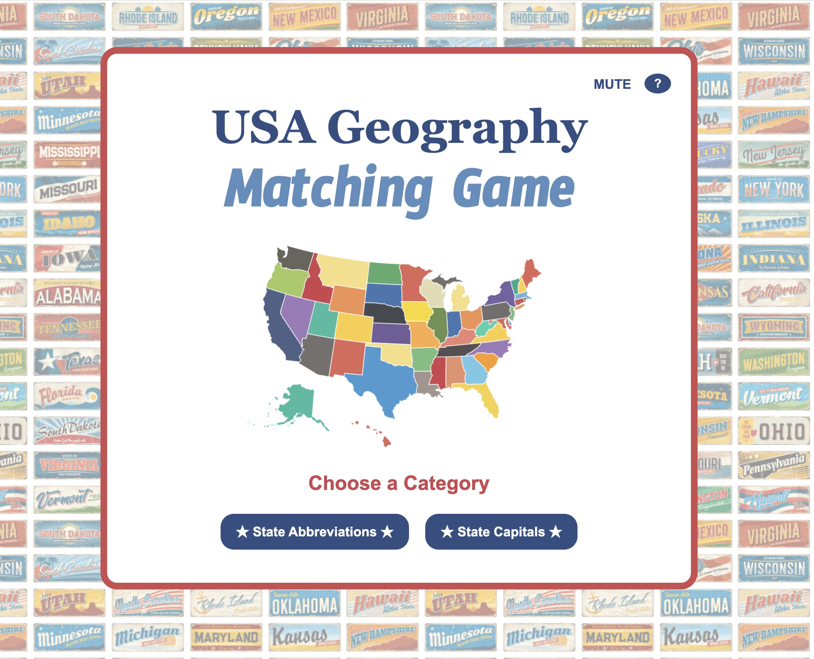

# USA Geography Matching Game

## Description

A fast-paced educational matching game where players test their knowledge of US state abbreviations and capitals. Choose a category, match 5 states with their correct answers, and race against a 20-second timer!

I was inspired by Duolingo, the language learning app, vocabulary matching exercises. 

## Play the Game

🎮 [Play USA Geography Matching Game](https://veggiebyte.github.io/us_geography_matching_game/)

## How to Play

1. Choose between **State Abbreviations** or **State Capitals**
2. Click a state name, then click its matching abbreviation or capital
3. Match all 5 pairs correctly within **20 seconds** and with **3 or fewer wrong guesses**
4. Green = correct match, Red = wrong match
5. Click "Play Again" to try a new set of random states!

## Planning Materials

- [Initial Wireframe, User Stories and Pseudocode](images/planning_info.pdf)

## Technologies Used

- **HTML5**
- **CSS3** (Flexbox for layout)
- **JavaScript** (DOM manipulation, event handling)
- **Adobe Photoshop** (background image optimization)
- **Adobe Illustrator** (USA map graphic)

## Attributions

### Fonts
- Georgia - Standard system font
- [Timmana](https://fonts.google.com/specimen/Timmana) - Google Fonts  
- [Electrolize](https://fonts.google.com/specimen/Electrolize) - Google Fonts

### Images
- Vintage license plate background - (many individual photos downloaded to create background [DepositPhotos](https://depositphotos.com/)
- USA map outline - [DepositPhotos](https://depositphotos.com/)

### Sound Effects
- All sound effects from [Pixabay](https://pixabay.com/sound-effects/)

### Libraries
- [Canvas Confetti](https://www.npmjs.com/package/canvas-confetti) - Celebration effects on win

## Code Resources

- [MDN Web Docs](https://developer.mozilla.org/) - JavaScript fundamentals, DOM manipulation, Audio API
- [W3Schools](https://www.w3schools.com/) - CSS Flexbox tutorials
- [Canvas Confetti Documentation](https://www.npmjs.com/package/canvas-confetti) - Confetti implementation
- General Assembly lesson materials - Functions, Event handling, game logic structure
- General google searches

## Features

- Two game modes: State Abbreviations and State Capitals
- Randomized state selection for replayability  
- 20-second countdown timer
- Visual feedback with color-coded matches
- Sound effects for correct/incorrect answers and game outcomes
- Mute/unmute sound option
- Interactive "How to Play" modal with help button
- Confetti celebration on win
- WCAG AA accessibility compliant

## Next Steps (Future Enhancements)

- Add difficulty levels (Easy: 30 seconds, Medium: 20 seconds, Hard: 10 seconds)
- Include all 50 states instead of random 5
- Add leaderboard with fastest completion times
- Mobile-responsive design with media queries
- Make interface more kid-friendly for classroom use
- Include educational facts about states on completion